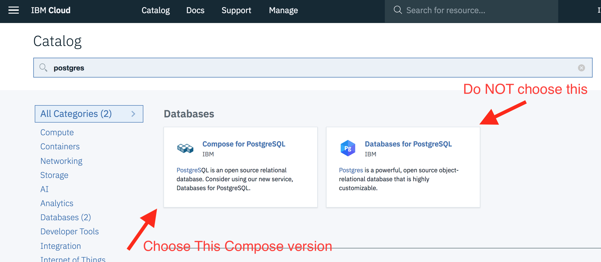

> **DISCLAIMER**: This notebook is used for demonstrative and illustrative purposes only and does not constitute an offering that has gone through regulatory review. It is not intended to serve as a medical application. There is no representation as to the accuracy of the output of this application and it is presented without warranty.

# Monitor WML Model With AI OpenScale

In this Code Pattern, we will continue from [Prediction Using Watson Machine Learning](https://github.com/IBM/watson-machine-learning-model-deploy) using the model for best drug treatment that was created and deployed. We will create a data mart for Watson Machine Learning deployments and include steps for performance, bias and quality monitor configurations.

When the reader has completed this Code Pattern, they will understand how to:

* Setup AI OpenScale Data Mart
* Bind Watson Machine Learning to the AIOS Data Mart
* Add subscriptions to the Data Mart
* Enable payload logging and performance monitor for both subscribed assets
* Enable Quality (Accuracy) monitor for best heart drug asset
* Enable Fairness monitor for best hurt drug asset
* Score the best-heart drug model using the Watson Machine Learning
* Use Data Mart to access tables data via subscription


## Flow

1. The developer creates a Jupyter Notebook on Watson Studio, using the existing project from [Prediction Using Watson Machine Learning](https://github.com/IBM/watson-machine-learning-model-deploy).
2. The Jupyter Notebook is connected to a PostgreSQL database, which is used to store AI OpenScale data.
3. The notebook is connected to Watson Machine Learning, where the existing ML model for Heart Medicine Predictor is used.
4. AI Open Scale is used by the notebook to log payload and monitor performance, quality, and fairness.

## Prerequisites

* An [IBM Cloud Account](https://console.bluemix.net).
* [IBM Cloud CLI](https://console.bluemix.net/docs/cli/index.html#overview)
* An account on [IBM Watson Studio](https://dataplatform.cloud.ibm.com/).
* Work through the notebook for [Prediction Using Watson Machine Learning](https://github.com/IBM/watson-machine-learning-model-deploy)

# Steps

1. [Clone the repository](#1-clone-the-repository)
1. [Create a Compose for PostgreSQL DB](#2-create-a-compose-for-postgresql-db)
1. [Create an AI OpenScale service](#3-create-an-ai-openscale-service)
1. [Create a notebook in IBM Watson Studio](#4-create-a-notebook-in-ibm-watson-studio)
1. [Run the notebook in IBM Watson Studio](#5-run-the-notebook-in-ibm-watson-studio)

### 1. Clone the repository

```bash
git clone https://github.com/IBM/monitor-wml-model-with-ai-openscale
cd monitor-wml-model-with-ai-openscale
```

### 2. Create a Compose for PostgreSQL DB

> Note: Services created must be in the same region, and space, as your Watson Studio service.

* Using the [IBM Cloud Dashboard](https://console.bluemix.net/catalog) catalog, search for PostgreSQL and choose the `Compose for Postgres` service:



* Wait a couple of minutes for the database to be provisioned.
* Click on the `Service Credentials` tab on the left and then click `New credential +` to create the service credentials. Copy them or leave the tab open to use later in the notebook.

### 3. Create an AI OpenScale service

* Using the [IBM Cloud Dashboard]() create an [AI OpenScale](https://console.bluemix.net/catalog/services/ai-openscale) service.
* You will get the AI OpenScale instance GUID when you run the notebook using the [IBM Cloud CLI](https://console.bluemix.net/catalog/services/ai-openscale)

### 4. Create a notebook in IBM Watson Studio

* In [Watson Studio](https://dataplatform.cloud.ibm.com/), open the project you created for [Prediction Using Watson Machine Learning](https://github.com/IBM/watson-machine-learning-model-deploy)
* In [Watson Studio](https://dataplatform.cloud.ibm.com/) using the project you've created, click on `+ Add to project` and then choose the  `Notebook` tile, OR in the `Assets` tab under `Notebooks` choose `+ New notebook` to create a notebook.
* Select the `From URL` tab.
* Enter a name for the notebook.
* Optionally, enter a description for the notebook.
* Under `Notebook URL` provide the following url: https://raw.githubusercontent.com/IBM/AIOpenScale-data-mart/master/notebooks/DataMart.ipynb
* Select the `Default Python 3.5` runtime, either `Free` or `XS`.
* Click the `Create` button.

### 5. Run the notebook in IBM Watson Studio

* Follow the instructions for `ACTION: Get data_mart_id (GUID) and apikey` using the [IBM Cloud CLI](https://console.bluemix.net/docs/cli/index.html#overview)

Get an IAM apikey:

```bash
ibmcloud login --sso
ibmcloud iam api-key-create 'my_key'
```

Get data_mart_id (this is AI OpenScale instance GUID):

```bash
ibmcloud resource service-instance <AIOpenScale_instance_name>
```

* Enter the `data_mart_id` and `apikey` in the next cell for the `aios_credentials`.
* In the cell after `ACTION: Add your Watson Machine Learning credentials here`, add the [Watson Machine Learning](https://console.bluemix.net/catalog/services/machine-learning) credentials for the service that you created for [Prediction Using Watson Machine Learning](https://github.com/IBM/watson-machine-learning-model-deploy).
* In the cell after `ACTION: Add your PostgreSQL credentials here` enter the value for the key `uri`.
> NOTE: This is the key `uri` and is NOT `uri_cli_1`, `uri_cli`, or `uri_direct_1`.
* Move your cursor to each code cell and run the code in it. Read the comments for each cell to understand what the code is doing. **Important** when the code in a cell is still running, the label to the left changes to **In [\*]**:.
  Do **not** continue to the next cell until the code is finished running.

# Sample Output


# License
[Apache 2.0](LICENSE)
