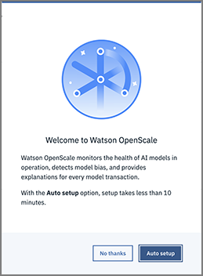
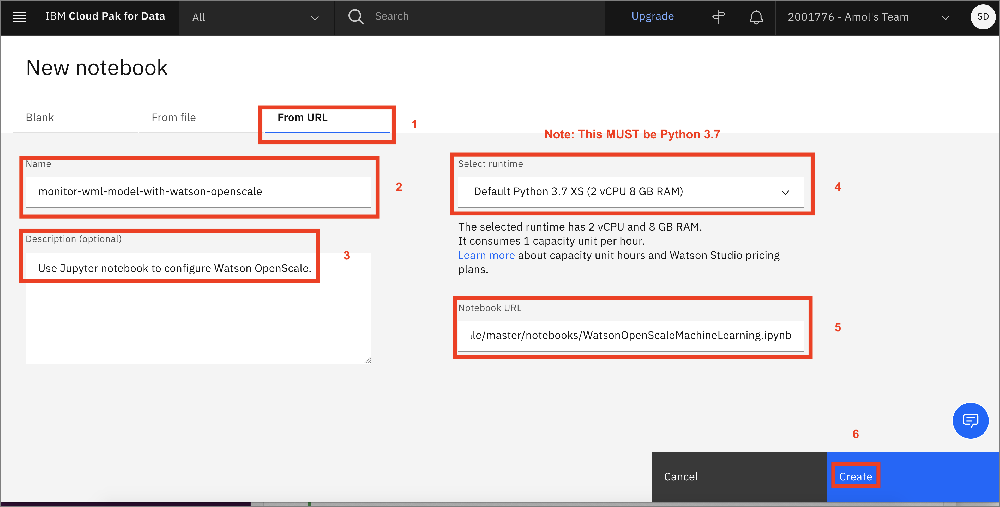
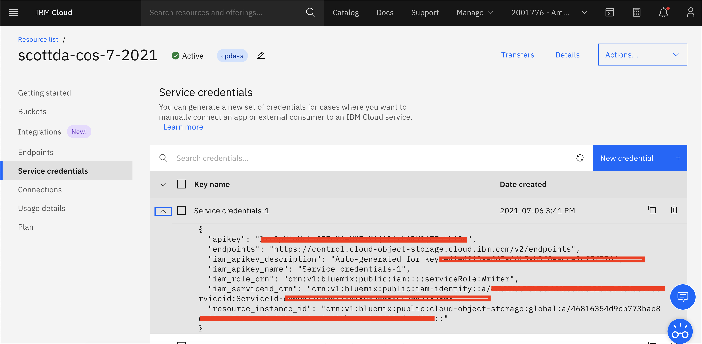
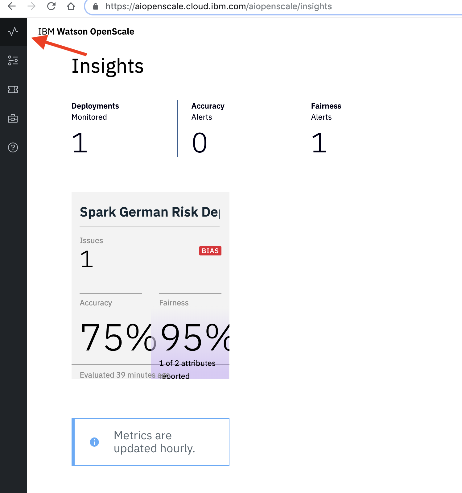
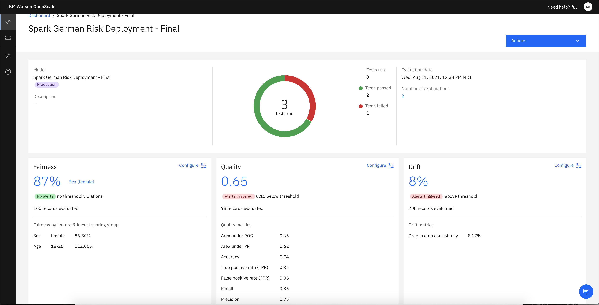
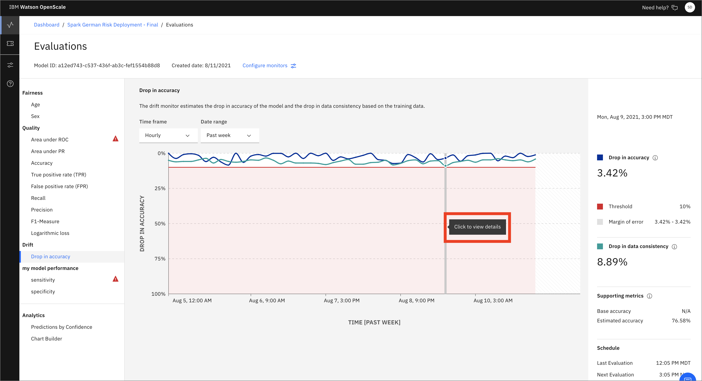
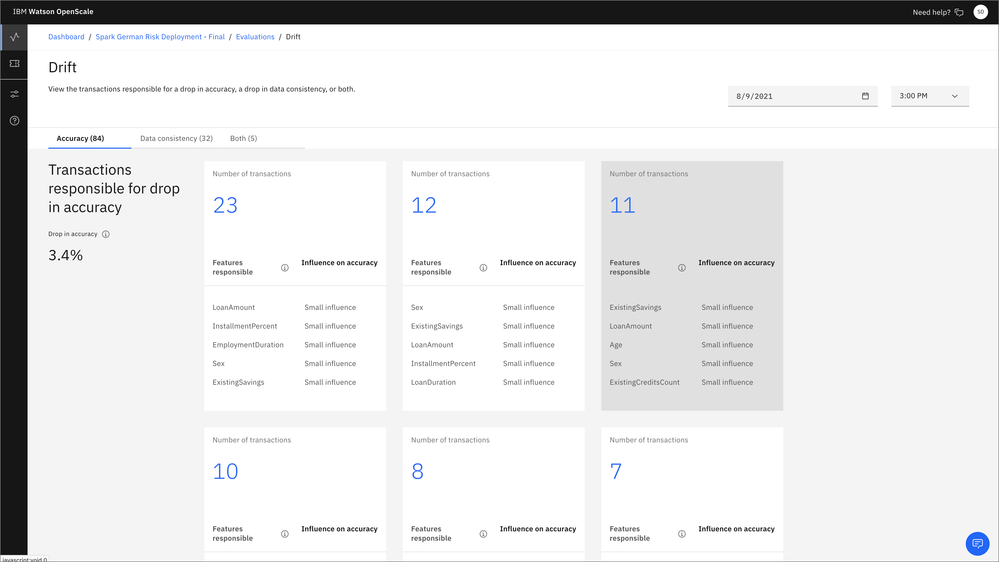
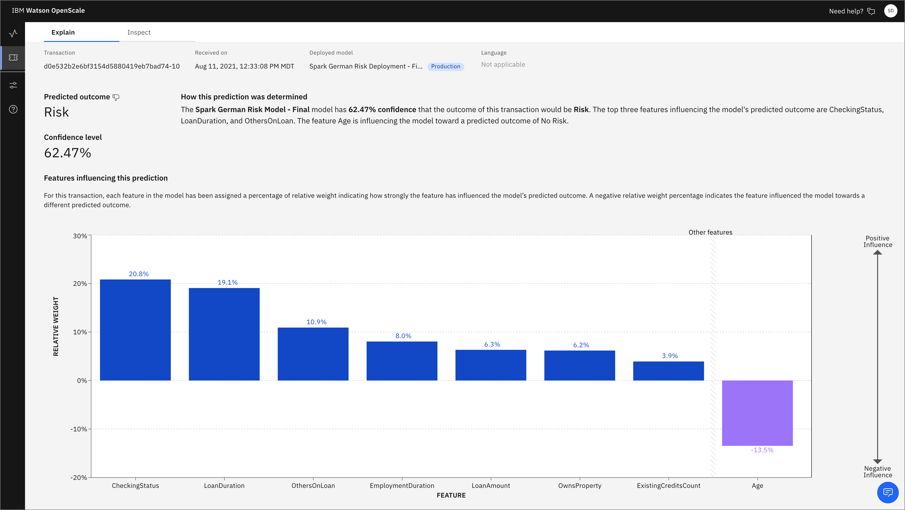

# Monitor WML Model With Watson OpenScale

In this Code Pattern, we will use German Credit data to train, create, and deploy a machine learning model using [Watson Machine Learning](https://console.bluemix.net/catalog/services/machine-learning). We will create a data mart for this model with [Watson OpenScale](https://www.ibm.com/cloud/watson-openscale/) and configure OpenScale to monitor that deployment, and inject seven days' worth of historical records and measurements for viewing in the OpenScale Insights dashboard.

When the reader has completed this Code Pattern, they will understand how to:

* Create and deploy a machine learning model using the Watson Machine Learning service
* Setup Watson OpenScale Data Mart
* Bind Watson Machine Learning to the Watson OpenScale Data Mart
* Add subscriptions to the Data Mart
* Enable payload logging and performance monitor for subscribed assets
* Enable Quality (Accuracy) monitor
* Enable Fairness monitor
* Enable Drift montitor
* Score the German credit model using the Watson Machine Learning
* Insert historic payloads, fairness metrics, and quality metrics into the Data Mart
* Use Data Mart to access tables data via subscription


## Flow

1. The developer creates a Jupyter Notebook on Watson Studio.
2. The Jupyter Notebook is connected to a PostgreSQL database, which is used to store Watson OpenScale data.
3. The notebook is connected to Watson Machine Learning and a model is trained and deployed.
4. Watson OpenScale is used by the notebook to log payload and monitor performance, quality, and fairness.

## Prerequisites

* An [IBM Cloud Account](https://cloud.ibm.com/)
* [IBM Cloud CLI](https://cloud.ibm.com/docs/cli/reference/ibmcloud/download_cli.html#install_use)
* [IBM Cloud Object Storage (COS)](https://www.ibm.com/cloud/object-storage)
* An account on [IBM Watson Studio](https://dataplatform.cloud.ibm.com/).

# Steps

1. [Clone the repository](#1-clone-the-repository)
1. [Use free internal DB or Create a Databases for PostgreSQL DB](#2-use-free-internal-db-or-create-a-databases-for-postgresql-db)
1. [Create a Watson OpenScale service](#3-create-a-watson-openscale-service)
1. [Create a Watson Machine Learning instance](#4-create-a-watson-machine-learning-instance)
1. [Create a notebook in IBM Watson Studio on Cloud Pak for Data](#5-create-a-notebook-in-ibm-watson-studio-on-cloud-pak-for-data)
1. [Run the notebook in IBM Watson Studio](#6-run-the-notebook-in-ibm-watson-studio)
1. [Setup OpenScale to utilize the dashboard](#7-setup-openscale-to-utilize-the-dashboard)

### 1. Clone the repository

```bash
git clone https://github.com/IBM/monitor-wml-model-with-watson-openscale
cd monitor-wml-model-with-watson-openscale
```

### 2. Use free internal DB or Create a Databases for PostgreSQL DB

#### If you wish, you can use the free internal Database with Watson OpenScale. To do this, make sure that the cell for `KEEP_MY_INTERNAL_POSTGRES = True` remains unchanged.

#### If you have or wish to use a paid `Databases for Postgres` instance, follow these instructions:

> Note: Services created must be in the same region, and space, as your Watson Studio service.

* Using the [IBM Cloud Dashboard](https://cloud.ibm.com/catalog) catalog, search for PostgreSQL and choose the `Databases for Postgres` [service](https://console.bluemix.net/catalog/services/databases-for-postgresql).
* Wait for the database to be provisioned.
* Click on the `Service Credentials` tab on the left and then click `New credential +` to create the service credentials. Copy them or leave the tab open to use later in the notebook.
* Make sure that the cell in the notebook that has:

```python
KEEP_MY_INTERNAL_POSTGRES = True
```

is changed to:

```python
KEEP_MY_INTERNAL_POSTGRES = False
```

### 3. Create a Watson OpenScale service

Create Watson OpenScale, either on the IBM Cloud or using your On-Premise Cloud Pak for Data.

<details><summary>On IBM Cloud</summary>

* If you do not have an IBM Cloud account, [register for an account](https://cloud.ibm.com/registration)

* Create a Watson OpenScale instance from the [IBM Cloud catalog](https://cloud.ibm.com/catalog/services/watson-openscale)

* Select the *Lite* (Free) plan, enter a *Service name*, and click *Create*.

* Click *Launch Application* to start Watson OpenScale.

* Click *Auto setup* to automatically set up your Watson OpenScale instance with sample data.

  

* Click *Start tour*  to tour the Watson OpenScale dashboard.

</details>

<details><summary>On IBM Cloud Pak for Data platform</summary>

> Note: This assumes that your Cloud Pak for Data Cluster Admin has already installed and provisioned OpenScale on the cluster.

* In the Cloud Pak for Data instance, go the (☰) menu and under `Services` section, click on the `Instances` menu option.

  

* Find the `OpenScale-default` instance from the instances table and click the three vertical dots to open the action menu, then click on the `Open` option.

  

* If you need to give other users access to the OpenScale instance, go the (☰) menu and under `Services` section, click on the `Instances` menu option.

  

* Find the `OpenScale-default` instance from the instances table and click the three vertical dots to open the action menu, then click on the `Manage access` option.

  

* To add users to the service instance, click the `Add users` button.

  

* For all of the user accounts, select the `Editor` role for each user and then click the `Add` button.

  

</details>

### 4. Create a Watson Machine Learning instance

* Under the `Settings` tab, scroll down to `Associated services`, click `+ Add service` and choose `Watson`:

  

* Search for `Machine Learning`, Verify this service is being created in the same space as the app in Step 1, and click `Create`.

  

* Alternately, you can choose an existing Machine Learning instance and click on `Select`.

* The Watson Machine Learning service is now listed as one of your `Associated Services`.

* In a different browser tab go to [https://cloud.ibm.com/](https://cloud.ibm.com/) and log in to the Dashboard.

* Click on your Watson Machine Learning instance under `Services`, click on `Service credentials` and then on `View credentials` to see the credentials.

  

* Save the credentials in a file. You will use them inside the notebook.

### 5. Create a notebook in IBM Watson Studio on Cloud Pak for Data

* In [Watson Studio](https://dataplatform.cloud.ibm.com/) or your on-premise Cloud Pak for Data, click `New Project +` under Projects or, at the top of the page click `+ New` and choose the tile for `Data Science` and then `Create Project`.

* Using the project you've created, click on `+ Add to project` and then choose the  `Notebook` tile, OR in the `Assets` tab under `Notebooks` choose `+ New notebook` to create a notebook.

* Select the `From URL` tab. [1]

* Enter a name for the notebook. [2]

* Optionally, enter a description for the notebook. [3]

* For `Runtime` select the `Default Spark Python 3.7 ` option. [4]

* Under `Notebook URL` provide the following url: [https://raw.githubusercontent.com/IBM/monitor-wml-model-with-watson-openscale/master/notebooks/WatsonOpenScaleMachineLearning.ipynb](https://raw.githubusercontent.com/IBM/monitor-wml-model-with-watson-openscale/master/notebooks/WatsonOpenScaleMachineLearning.ipynb)

> Note: The current default (as of 8/11/2021) is Python 3.8. This will cause an error when installing the `pyspark.sql SparkSession` library, so make sure that you are using Python 3.7

* Click the `Create notebook` button. [6]



### 6. Run the notebook in IBM Watson Studio

Follow the instructions for `Provision services and configure credentials`:

Your Cloud API key can be generated by going to the [**Users** section of the Cloud console](https://cloud.ibm.com/iam#/users).

* From that page, click your name, scroll down to the **API Keys** section, and click **Create an IBM Cloud API key**.

* Give your key a name and click **Create**, then copy the created key and paste it below.

Alternately, from the [IBM Cloud CLI](https://console.bluemix.net/docs/cli/reference/ibmcloud/download_cli.html#install_use) :

```bash
ibmcloud login --sso
ibmcloud iam api-key-create 'my_key'
```

* Enter the `CLOUD_API_KEY` in the cell `1.1 Cloud API key`.

#### Create COS bucket and get credentials

* In your [IBM Cloud Object Storage](https://www.ibm.com/cloud/object-storage)  instance, create a bucket with a globally unique name. The UI will let you know if there is a naming conflict. This will be used in cell *1.3.1* as *BUCKET_NAME*.

* In your [IBM Cloud Object Storage](https://www.ibm.com/cloud/object-storage) instance, get the Service Credentials for use as `COS_API_KEY_ID`, `COS_RESOURCE_CRN`, and `COS_ENDPOINT`:

  

* Add the COS credentials in cell *1.2 Cloud object storage details*.

* Insert your BUCKET_NAME in the cell *1.2.1 Bucket name*.

* Either use the internal Database, which requires *No Changes* or Add your `DB_CREDENTIALS` after reading the instructions preceeding that cell and change the cell `KEEP_MY_INTERNAL_POSTGRES = True` to become `KEEP_MY_INTERNAL_POSTGRES = False`.

* Move your cursor to each code cell and run the code in it. Read the comments for each cell to understand what the code is doing. **Important** when the code in a cell is still running, the label to the left changes to **In [\*]**:.
  Do **not** continue to the next cell until the code is finished running.

## 7. Setup OpenScale to utilize the dashboard

Now that you have created a machine learning model, you can utilize the [OpenScale dashboard](https://aiopenscale.cloud.ibm.com) to gather insights.

### Sample Output

You can find a sample notebook with output for [WatsonOpenScaleMachineLearning-with-outputs.ipynb](notebooks/with-outputs/WatsonOpenScaleMachineLearning-with-outputs.ipynb).

#### Openscale Dashboard

* Go to the instance of [Watson OpenScale](https://aiopenscale.cloud.ibm.com/aiopenscale/insights) for an IBM Cloud deployment, or to your deployed instance on Cloud Pak for Data on-premise version. Choose the `Insights` tab to get an overview of your monitored deployments, Accuracy alerts, and Fairness alerts.



* Click on the tile for the `Spark German Risk Deployment` and you can see tiles for the `Fairness`, `Accuracy`, and `Performance monitors`.



* Click on one of the tiles, such as *Drift* to view details. Click on a point on the graph for more information on that particular time slice.



* You will see which types of drift were detected. Click on the number to bring up a list of transactions that led to drift.



* Click on the `Explain` icon on the left-hand menu and you'll see a list of transactions that have been run using an algorithm to provide explainability. Choose one and click `Explain`.


* You will see a graph showing all the most influential features with the relative weights of contribution to the *Predicted outcome*.



* Click the `Inspect` tab and you can experiment with changing the values of various features to see how that would affect the outcome. Click the `Run analysis` button to see what changes would be required to change the outcome.


# License
[Apache 2.0](LICENSE)
