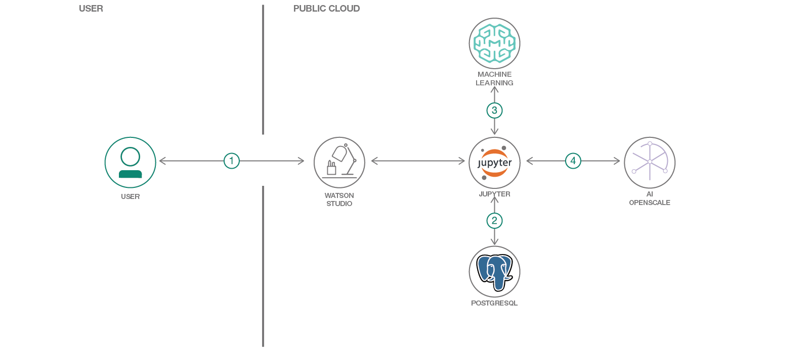
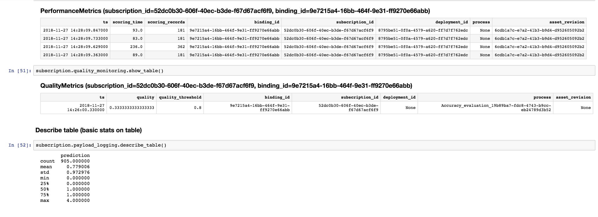
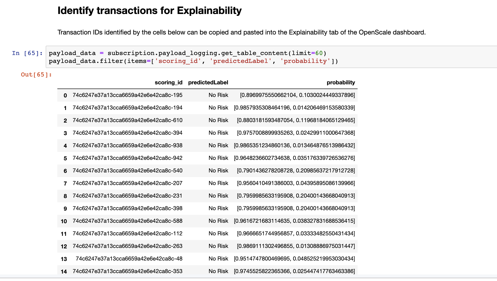

# Monitor WML Model With Watson OpenScale

In this Code Pattern, we will use German Credit data to train, create, and deploy a machine learning model using [Watson Machine Learing](https://console.bluemix.net/catalog/services/machine-learning). We will create a data mart for this model with [Watson OpenScale] and configure OpenScale to monitor that deployment, and inject seven days' worth of historical records and measurements for viewing in the OpenScale Insights dashboard.

When the reader has completed this Code Pattern, they will understand how to:

* Create and deploy a machine learning model using the Watson Machine Learning service
* Setup Watson OpenScale Data Mart
* Bind Watson Machine Learning to the Watson OpenScale Data Mart
* Add subscriptions to the Data Mart
* Enable payload logging and performance monitor for subscribed assets
* Enable Quality (Accuracy) monitor
* Enable Fairness monitor
* Score the German credit model using the Watson Machine Learning
* Insert historic payloads, fairness metrics, and quality metrics into the Data Mart
* Use Data Mart to access tables data via subscription



## Flow

1. The developer creates a Jupyter Notebook on Watson Studio.
2. The Jupyter Notebook is connected to a PostgreSQL database, which is used to store Watson OpenScale data.
3. The notebook is connected to Watson Machine Learning and a model is trained and deployed.
4. Watson OpenScale is used by the notebook to log payload and monitor performance, quality, and fairness.

# Watch the Video

[](https://youtu.be/ux2cv5HkaSw)

## Prerequisites

* An [IBM Cloud Account](https://cloud.ibm.com).
* [IBM Cloud CLI](https://cloud.ibm.com/docs/cli/index.html#overview)
* An account on [IBM Watson Studio](https://dataplatform.cloud.ibm.com/).

# Steps

1. [Clone the repository](#1-clone-the-repository)
1. [Create a Databases for PostgreSQL DB](#2-create-a-databases-for-postgresql-db)
1. [Create a Watson OpenScale service](#3-create-a-watson-openscale-service)
1. [Create a notebook in IBM Watson Studio](#4-create-a-notebook-in-ibm-watson-studio)
1. [Run the notebook in IBM Watson Studio](#5-run-the-notebook-in-ibm-watson-studio)

### 1. Clone the repository

```bash
git clone https://github.com/IBM/monitor-wml-model-with-watson-openscale
cd monitor-wml-model-with-watson-openscale
```

### 2. Create a Databases for PostgreSQL DB

> Note: Services created must be in the same region, and space, as your Watson Studio service.

* Using the [IBM Cloud Dashboard](https://cloud.ibm.com/catalog) catalog, search for PostgreSQL and choose the `Databases for Postgres` [service](https://console.bluemix.net/catalog/services/databases-for-postgresql).
* Wait a couple of minutes for the database to be provisioned.
* Click on the `Service Credentials` tab on the left and then click `New credential +` to create the service credentials. Copy them or leave the tab open to use later in the notebook.

### 3. Create a Watson OpenScale service

* Using the [IBM Cloud Dashboard]() create a [Watson OpenScale](https://cloud.ibm.com/catalog/services/ai-openscale) service.
* You will get the Watson OpenScale instance GUID when you run the notebook using the [IBM Cloud CLI](https://cloud.ibm.com/catalog/services/ai-openscale)

### 4. Create a notebook in IBM Watson Studio

* In [Watson Studio](https://dataplatform.cloud.ibm.com/), click `New Project +` under Projects or, at the top of the page click `+ New` and choose the tile for `Data Science` and then `Create Project`.
* In your project go to the `Settings` tab, scroll down to `Associated Services` and choose `+ Add service` -> `Spark`. Either choose and `Existing` Spark service, or create a `New` one.
* In [Watson Studio](https://dataplatform.cloud.ibm.com/) using the project you've created, click on `+ Add to project` and then choose the  `Notebook` tile, OR in the `Assets` tab under `Notebooks` choose `+ New notebook` to create a notebook.
* Select the `From URL` tab.
* Enter a name for the notebook.
* Optionally, enter a description for the notebook.
* Under `Notebook URL` provide the following url: https://raw.githubusercontent.com/IBM/monitor-wml-model-with-watson-openscale/master/notebooks/OpenScale.ipynb
* Select the Spark runtime you've associated with this project:
* Click the `Create` button.

### 5. Run the notebook in IBM Watson Studio

Follow the instructions for `Provision services and configure credentials`:

Your Cloud API key can be generated by going to the [**Users** section of the Cloud console](https://cloud.ibm.com/iam#/users).
* From that page, click your name, scroll down to the **API Keys** section, and click **Create an IBM Cloud API key**.
* Give your key a name and click **Create**, then copy the created key and paste it below.

Alternately, from the [IBM Cloud CLI](https://console.bluemix.net/docs/cli/reference/ibmcloud/download_cli.html#install_use) :

```bash
bx login --sso
bx iam api-key-create 'my_key'
```

* Get the Watson OpenScale GUID using the [IBM Cloud CLI](https://console.bluemix.net/docs/cli/reference/ibmcloud/download_cli.html#install_use) :

```bash
bx resource service-instance <Watson_OpenScale_instance_name>
```

* Enter the `AIOS_GUID` and `CLOUD_API_KEY` in the next cell for the `AIOS_CREDENTIALS`.
* Add the [Watson Machine Learning](https://cloud.ibm.com/catalog/services/machine-learning) credentials for the service that you created in the next cell as `WML_CREDENTIALS`.
* Add your `DB_CREDENTIALS` after reading the instructions preceeding that cell.

* Move your cursor to each code cell and run the code in it. Read the comments for each cell to understand what the code is doing. **Important** when the code in a cell is still running, the label to the left changes to **In [\*]**:.
  Do **not** continue to the next cell until the code is finished running.

# Sample Output






# License
[Apache 2.0](LICENSE)
